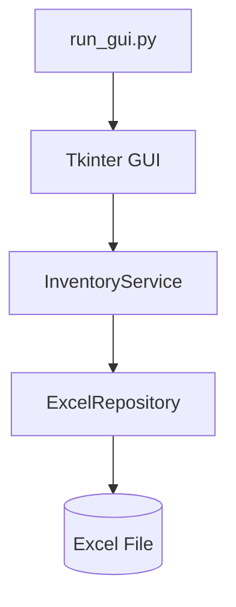
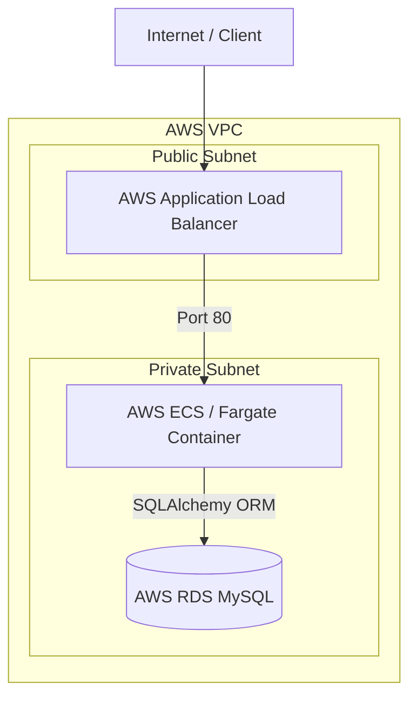

# Inventory Management System (AWS & Terraform)


## 📦 Inventory Management System

An end-to-end, lightweight inventory management platform designed for daily stock **IN / OUT** tracking.

### 💡 Project Evolution
* **v1.0 (Desktop MVP):** Originally built as an internal tool for a small business, utilizing a **Tkinter GUI** with **Excel-based storage** for quick operational deployment.
* **v2.0 (Production Backend):** Refactored into a scalable, maintainable enterprise solution powered by **FastAPI**, **MySQL**, **SQLAlchemy ORM**, **Docker Compose**, automated testing, **GitHub Actions CI**, and **Docker Hub** integration.

---

## ✨ Key Features

### 📦 Core Business & Application
* **Stock Management:** Streamlined inventory IN / OUT operation workflows.
* **Dual Interface:** Supports legacy Tkinter Desktop GUI alongside modern FastAPI RESTful endpoints.
* **Dual Data Layer:** Hybrid support for Excel-based file storage (baseline) and enterprise MySQL database.

### 🏗 Architecture & Code Quality
* **Clean Architecture:** Strict separation between Service Layer and Repository Layer.
* **Dependency Injection:** Modularized backend design with FastAPI's dependency injection system.
* **Domain Validation:** Robust business-rule validations and centralized error handling.

### 🧪 Quality Assurance & Testing
* **Automated Testing:** Comprehensive unit and integration testing suite powered by `pytest`.
* **Coverage Enforcement:** Enforced strict code coverage thresholds integrated directly into the CI pipeline.
* **Sample Data:** Pre-configured safe sample datasets for instant onboarding and testing.

### 🤖 DevOps & AI-Powered CI/CD
* **Containerization:** One-command local environment setup via Docker Compose.
* **Automated Pipeline:** GitHub Actions for continuous integration, automated testing, and Docker Hub registry publishing.
* **AI CI Diagnosis:** Integrated OpenAI API (`gpt-4o-mini`) to automatically diagnose CI pipeline test failures.
* **AI Code Review:** Automated PR code reviews and quality checks powered by CodeRabbit AI.

---

## 🏗 Architecture

The project contains two decoupled execution paths sharing core business logic patterns.

### 1. Excel-Based GUI Baseline



### 2. Cloud-Native Backend Architecture (FastAPI + AWS ECS / RDS)

The Excel-based GUI is retained as the stable original implementation. The FastAPI + MySQL path demonstrates how the business logic evolves into a containerized, cloud-native RESTful API deployed on AWS infrastructure via Terraform.

#### ☁️ AWS Cloud Infrastructure



```text
HTTP Client / Swagger UI
    ↓
FastAPI Endpoints
    ↓
InventoryMySQLService (Business Logic & Validation)
    ↓
MySQLRepository (Persistence Abstraction)
    ↓
SQLAlchemy ORM
    ↓
AWS RDS MySQL Database

```

## 📁 Project Structure

Key project files and directories:

```text
inventory-db-aws-terraform/
├── .github/
│   └── workflows/
│       └── ci.yml             # GitHub Actions CI pipeline configuration
├── api/
│   └── fastapi_app.py         # FastAPI instance setup and route definitions
├── app/
│   ├── db.py                  # Database connection & SQLAlchemy Session setup
│   ├── mysql_models.py        # SQLAlchemy ORM Data Models
│   └── check_*.py             # Health check & diagnostic scripts
├── config/
│   └── constants.py           # Application constants & configuration settings
├── core/
│   ├── exceptions.py          # Custom domain exceptions
│   ├── inventory_service.py   # Business logic for Excel baseline
│   ├── inventory_mysql_service.py # Business logic for MySQL engine
│   └── item.py                # Core Domain models
├── data/
│   └── sample_inventory.xlsx  # Safe sample dataset for local testing
├── repository/
│   ├── excel_repository.py    # Data access layer for Excel persistence
│   └── mysql_repository.py    # Data access layer for MySQL via SQLAlchemy
├── terf/                      # Infrastructure as Code (Terraform)
│   ├── modules/               # Reusable Terraform modules
│   ├── backend.tf             # S3 backend & DynamoDB state locking
│   ├── dns_acm.tf             # Route53 DNS & ACM SSL Certificate management
│   ├── ecr.tf                 # AWS ECR container repository setup
│   ├── ecs.tf                 # AWS ECS Fargate cluster, service, & task definitions
│   ├── main.tf / variables.tf # Primary terraform provider & input configuration
│   └── outputs.tf / terraform.tfvars # Deployment outputs & environment variables
├── tests/                     # Unit and integration test suite (pytest)
├── ui/
│   └── gui_app.py             # Tkinter Desktop GUI interface
├── Dockerfile                 # Container image build instructions
├── docker-compose.yml         # Local multi-container development environment
├── run_api.py                 # Entry point for FastAPI backend
└── run_gui.py                 # Entry point for Desktop GUI

```

Generated cache files, local environment files, database data, test artifacts, and private Excel files are intentionally omitted from this structure.

---

## ⚙️ Requirements & Prerequisites

### Local Development Environment
* **Python:** `3.10+`
* **Package Manager:** `pip`
* **Database (Optional for API path):** `MySQL 8.0+`

### Container Environment
* **Docker Engine:** `20.10+`
* **Docker Compose:** `v2.0+`

---

## 🚀 Quick Start & Installation

### 1. Clone Repository & Setup Virtual Environment

```bash
git clone https://github.com/alextwtp/inventory-db-aws-terraform.git
cd inventory-db-aws-terraform

# Create and activate virtual environment
python3 -m venv venv
source venv/bin/activate  # On Windows: venv\Scripts\activate

```

---

---

### 2. Install Dependencies

```bash
pip install --upgrade pip
pip install -r requirements.txt

```

### 3. Environment Configuration
Create a local `.env` file based on `.env.example`:

```bash
cp .env.example .env

```

Example host configuration (if access via alextwtp.com):

```env
DB_HOST=<your database url>
DB_PORT=3306
DB_NAME=<your database name>
DB_USER=<your ID>
DB_PASSWORD= <your password>

```
Security Warning: The actual .env file contains sensitive credentials and is strictly excluded via .gitignore. Never commit .env files to version control.

### MySQL Port Mapping (if run through run_api.py)

When connecting from the host machine or WSL:

```env
DB_HOST=127.0.0.1
DB_PORT=3307

```

When the application connects to MySQL inside Docker Compose:

```env

DB_HOST=mysql
DB_PORT=3306

```

Example MySQL Workbench connection:

```text
Host: 127.0.0.1
Port: 3307
User: root
Database: inventory_db

```
---

## 🖥️ Run the Excel-Based GUI

The GUI version is the original baseline implementation and operates directly with the Excel repository.

### Launch Instructions
Run the GUI from the project root:

```bash
# macOS / Linux
python3 run_gui.py

# Windows
python run_gui.py

```

>
💡 Architecture Note: The GUI entry script automatically instantiates the Tkinter interface and injects both ExcelRepository and InventoryService. The FastAPI server and MySQL database are not required when running this standalone desktop path.

---

## Run MySQL with Docker Compose

Start the configured services:

```bash
docker compose up -d

```

Check service status:

```bash
docker compose ps

```

View service logs:

```bash
docker compose logs

```

Stop the services:

```bash
docker compose down

```

Remove the services and the MySQL data volume:

```bash
docker compose down -v

```

> Warning: `docker compose down -v` removes the database volume and its stored data.

---

## Run the FastAPI + MySQL API

Start MySQL first:

```bash
docker compose up -d

```

Container Management Commands
Check service status:

```bash
docker compose ps

```

View real-time service logs:

```bash
docker compose logs -f

```

Stop the running services:

```bash
docker compose down

```

Stop services and wipe the persistent database volume:

```bash
docker compose down -v

```
Then start the FastAPI server from the project root:

```bash
python run_api.py

```

Default API URL:

```text
http://127.0.0.1:8000

```

Interactive Swagger documentation:

```text
http://127.0.0.1:8000/docs

```
---

## 🔌 FastAPI + MySQL API Endpoints

When running locally via `python run_api.py` or via Docker Compose (`http://127.0.0.1:8000`).

---

### 1. Health Check
`GET /`

* **Response Example:**

```json
{
  "status": "ok",
  "message": "Inventory MySQL API is running"
}

```

### 2. Get Item Details

```http
GET /item/{pid}

```

Example:

```bash
curl http://127.0.0.1:8000/item/A001

```

### 3. Inventory IN (Stock Inbound)

```http
POST /inventory/in

```

Example request:

```bash
curl -X POST http://127.0.0.1:8000/inventory/in \
  -H "Content-Type: application/json" \
  -d '{
    "pid": "A001",
    "name": "Mouse",
    "qty": 5,
    "receiver": "",
    "shipper": "Vendor A"
  }'

```

### 4. Inventory OUT (Stock Outbound)

```http
POST /inventory/out

```

Example request:

```bash
curl -X POST http://127.0.0.1:8000/inventory/out \
  -H "Content-Type: application/json" \
  -d '{
    "pid": "A001",
    "name": "Mouse",
    "qty": 2,
    "receiver": "Customer A",
    "shipper": ""
  }'

```

---

### Expected MySQL API Response

Example successful response (`200 OK`):

```json
{
  "status": "success",
  "message": "Item found",
  "item": {
    "pid": "A001",
    "name": "Mouse",
    "current_qty": 10,
    "buyer": "",
    "shipper": ""
  }
}

```

Error Handling Strategy:

Application-level validation errors are automatically caught and formatted into standard HTTP responses (e.g., 400 Bad Request, 404 Not Found).

Unexpected SQLAlchemy or transaction failures trigger an immediate database session rollback and return an HTTP 500 Internal Server Error.

Application-level errors are converted into appropriate HTTP responses.

Unexpected SQLAlchemy errors trigger a database rollback and return an HTTP 500 database error response.

---

## Manual Database Checks

The project includes custom diagnostic scripts to independently verify MySQL connectivity, schema creation, and ORM behavior outside the main application lifecycle.

### Diagnostic Suite Execution

```bash
# 1. Verify raw MySQL connection
python3 app/check_mysql_conn.py

# 2. Verify table schema and structure
python3 app/check_database.py

# 3. Verify SQLAlchemy ORM Operations
python3 app/check_inventory_orm.py

Typical Output Verification

Database connection successful
Table created or verified successfully
ORM operation completed successfully

Note: These scripts are reserved for manual integration testing and local environment sanity checks. They operate independently from the automated pytest test suite.

```
---

## 🧪 Testing & Automated Verification

The project includes unit and integration tests written with `pytest`, covering both repository implementations and API endpoints.

### Executing Test Suite

Run the full test suite in quiet mode:

```bash
pytest -q

```

Run tests with line-by-line coverage analysis:

```bash
pytest --cov=. --cov-report=term-missing

```

### Verified Test Results:

```text
57 passed, 1 skipped
Required test coverage of 80% reached
Total coverage: 85.12%

```

### Testing Strategy

The automated test suite covers:

* **Business Logic:** Core inventory business rules, stock IN/OUT transactions, and edge cases (invalid quantity, insufficient stock, item not found).
* **Data Access & Repositories:** Data persistence behavior for both Excel and MySQL storage layers.
* **API & Web Layer:** FastAPI routing, request/response validation, dependency injection wiring, and global error handling.
* **Transaction Safety:** Database session rollback behavior under failure conditions.

> ⚡ **Mocking & Isolation Design:** API-layer unit tests utilize mock/fake service objects where appropriate. This design choice keeps the execution extremely fast and deterministic without requiring a running MySQL container for every test run.
> 
> The live MySQL integration path is verified independently through Docker Compose and manual database diagnostic scripts.

---

## 📊 Sample Inventory Data

A safe sample Excel file is provided for testing and system demonstration:

```text
data/sample_inventory.xlsx

```

### Safety & Version Control Policy

* Data Privacy: The included sample file contains mock data only and is completely free of sensitive or confidential business information.

* Test Side-Effects: Local execution of Excel-based test suites may temporarily alter this file. To revert local changes prior to committing:

```bash
git restore data/sample_inventory.xlsx

```

---

## ⚙️ GitHub Actions CI/CD & AI-Driven Failure Diagnosis

The project utilizes GitHub Actions for automated testing, intelligent AI-driven failure diagnosis, code review automation, and container delivery.

### Workflow Architecture

```text
Source Push / PR
    ↓
Set up Python & Dependencies
    ↓
Run pytest & Coverage Gate (80%)
    ├─► [SUCCESS] ──► Build Docker Image ──► Push to Docker Hub
    │
    └─► [FAILURE] ──► Trigger AI Failure Diagnosis (OpenAI API)
                            ↓
                      Parse pytest.log
                            ↓
                      Generate Actionable Fix Suggestions

```

### Key Pipeline Features
1. **Automated Testing & Coverage Gate:** Enforces a strict minimum threshold of 80% test coverage. If tests fail or 
     coverage drops below the limit, the pipeline terminates immediately.
2. **AI Failure Diagnosis (`gpt-4o-mini`):**
   * **Strict Failure Capture:** Uses Bash Strict Mode (`set -euo pipefail`) to ensure test failure exit codes are accurately trapped.
   * **Automated Log Parsing:** On pipeline failure, a dedicated Python script extracts the `pytest.log` error payload.
   * **Resilience:** Implements explicit request timeouts (30s) and calls `gpt-4o-mini` for swift, low-latency analysis.
   * **Actionable Feedback:** Outputs senior-engineer-level troubleshooting steps and immediate code fix suggestions directly into the GitHub Actions run logs.
3. **Automated Code Review:** Integrates CodeRabbit AI to perform line-by-line automated code reviews and static 
     analysis on Pull Requests.
4. **Automated Docker Deployment:** Builds and pushes updated container images to Docker Hub upon successful test 
     suites on the `master` branch.

---

## 🐳 Docker Container Registry & Images

The application image is packaged and published to Docker Hub for public verification, artifact storage, and standardized containerized deployments.

### Public Image Artifacts
* **Repository:** `alextwtpyeh/inventory-db-aws-terraform`
* **Versioned Tag:** `alextwtpyeh/inventory-db-aws-terraform:v2.0.0`
* **Latest Tag:** `alextwtpyeh/inventory-db-aws-terraform:latest`

### Pull and Verify Container Image

Pull the versioned production artifact:

```bash
docker pull alextwtpyeh/inventory-db-aws-terraform:v2.0.0

```
Verify container environment & Python runtime:

```bash
docker run --rm alextwtpyeh/inventory-db-aws-terraform:v2.0.0 python --version

```

Execute containerized automated tests inside isolated image:

```bash
docker run --rm alextwtpyeh/inventory-db-aws-terraform:v2.0.0 pytest -q

```

☁️ Infrastructure Evolution Note:

The Docker Hub repository serves as the public container registry for application image artifacts and automated testing verification.

In the latest AWS cloud infrastructure pipeline, images are dynamically built and managed alongside Terraform IaC provisioning (trf/ module) for cloud-native deployment.

---

### Automated Container Publishing & Security

On a successful push to the `master` branch, the deployment workflow executes:

```text
Source Push
    ↓
GitHub Actions Pipeline
    ↓
pytest & Coverage Gate Verification
    ↓
Build Container Image
    ↓
Authenticate via Encrypted Repository Secrets
    ↓
Push Artifacts to Registry

```

#### Secret Management & Security Policy

Sensitive registry credentials are strictly managed outside the source repository using encrypted GitHub Secrets:

* `DOCKERHUB_USERNAME`: Automated build account identity.
* `DOCKERHUB_TOKEN`: Scoped Personal Access Token (PAT) with read/write permissions.

> 🔒 **Zero Hardcoded Credentials:** The GitHub Actions runner dynamically injects these secrets during the container authentication phase, guaranteeing zero exposure of raw credentials in code or repository logs.
>
> 💡 **Multi-Registry Pipeline Configuration (Optional):**
> The CI/CD workflow is pre-configured with a **Dual-Push Strategy** (Docker Hub for public artifact access, AWS ECR for private cloud deployment).
>
> If you are cloning or running this project in your own environment, you can tailor the pipeline steps based on your setup:
> * **Public Distribution Only:** Comment out or remove the AWS ECR authentication and push steps (`Phase #4`) if you do not use AWS.
> * **Private Cloud Only:** Comment out the Docker Hub publishing step (`Phase #3`) if you only deploy to your private AWS registry.

---

## 🛡️ Security and Data-Safety Controls

The project adheres to strict **DevSecOps** principles, zero-trust configuration management, and least-privilege deployment safety controls:

### 🔑 Credential & Secret Isolation
* **Local Runtime Environment:** Production runtime credentials, API keys, and database passwords reside strictly in `.env`, which is permanently excluded via `.gitignore`.
* **Safe Configuration Templates:** `.env.example` provides non-sensitive placeholder configurations for rapid developer onboarding without exposing actual secrets.
* **Zero Hardcoded Secrets:** Application source code and Terraform templates consume credentials via dynamic environment variable injections (`os.getenv`).
* **CI/CD Secret Store:** Sensitive pipeline variables—including `DOCKERHUB_USERNAME`, `DOCKERHUB_TOKEN`, and `OPENAI_API_KEY`—are encrypted within **GitHub Repository Secrets**.

### 📊 Data Safety & Privacy
* **Operational Data Isolation:** Real-world operational files, internal reports, and generated output artifacts are fully excluded from version control.
* **Sanitized Test Fixtures:** Only synthetic, non-sensitive sample inventory datasets are committed for unit testing and test-suite validation.

### 🚀 Pipeline & Guardrail Controls
* **Automated Quality Gate Enforcement:** Docker images are compiled and published **only after** all unit tests pass and the strict 80% test coverage threshold is met.
* **Ephemeral Container Security:** Application runtimes within Docker containers operate using non-persistent file boundaries with database configuration injected externally at runtime.

---

## 💻 Platform-Specific Notes & Port Mapping

### ⚠️ Excel File Lock Detection under WSL / Cross-OS
When the application runs inside **WSL (Windows Subsystem for Linux)** or a Linux container while the target `.xlsx` file is open in Windows Excel, the Linux process may not reliably trap the file lock due to fundamental differences in OS-level file locking behaviors:

* **Windows:** Uses mandatory file locking when an Excel workbook is open.
* **WSL / Linux Environment:** Expects POSIX file advisory locks, which do not directly intercept Windows file handlers.
* **Recommendation:** Close active Excel workbooks in Windows before triggering manual CLI imports, or execute the Excel-based workflows directly in a native Windows Python environment for full file-lock safety.

### 🔌 Host & Container Port Mapping

To prevent port conflicts with local database instances, application services use explicit container-to-host port forwarding:

* **MySQL Database Service:**
  * **Container Internal Port:** `3306` (within the Docker virtual network)
  * **Host Mapped Port:** `3307` (exposed on localhost for external client connections)
* **FastAPI Application Server:**
  * **Container Internal Port:** `8000`
  * **Host Mapped Port:** `8000` (accessible via `http://localhost:8000`)

---

## 🌟 Technical Highlights & Engineering Practices

This project demonstrates the architectural modernization of a legacy desktop tool into an enterprise-grade backend service, integrated with cloud-native infrastructure and AI-driven automation.

### Key Architectural Concepts
* **Layered Architecture:** Clear separation of concerns utilizing Service & Repository design patterns.
* **Dependency Injection:** Loosely-coupled components for testability and runtime flexibility.
* **RESTful API Design:** Built with FastAPI and validated via Pydantic schemas.
* **ORM & Database Integration:** Robust MySQL management leveraging SQLAlchemy ORM.
* **Test-Driven Rigor:** Comprehensive unit testing with `pytest`, API mock/fake dependencies, and strict 80% coverage gates.
* **Containerization:** Multi-stage Docker packaging, local orchestration via Docker Compose, and public image publishing.
* **Infrastructure as Code (IaC):** AWS cloud provisioning (`trf/` module) using Terraform for VPC, RDS MySQL, and Security Groups.
* **Automated CI/CD:** GitHub Actions workflows with strict coverage thresholds and dual-push deployment strategies.
* **🤖 LLM API Integration:** Automated test-failure log analysis powered by OpenAI API (`gpt-4o-mini`).
* **⚡ CI/CD Resiliency:** Trapped failure exit codes using Bash Strict Mode (`set -eo pipefail`) with explicit HTTP timeout safeguards.
* **🔐 Security Policy:** Zero hardcoded credentials via dynamic environment variables (`.env`) and GitHub Repository Secrets.

---

## 🚀 Future Improvements and Design Roadmap

The following design considerations represent planned engineering enhancements for future system scalability and production readiness:

### 📑 Pagination & Dynamic Filtering
* Implement server-side limit/offset pagination and dynamic filtering parameters for inventory query endpoints.
* **Goal:** Prevent high memory overhead when retrieving large-scale enterprise datasets.

### ⚡ Redis Caching Layer
* Integrate Redis to cache high-frequency inventory read operations with strict Time-To-Live (TTL) expiration strategies.
* **Mitigation Strategies for Caching Risks:**
  * **Cache Penetration:** Implement Bloom Filters or store empty key markers for non-existent inventory IDs.
  * **Cache Breakdown:** Use mutex/distributed locks during cache refresh operations.
  * **Cache Avalanche:** Apply randomized jitter to TTL values to avoid synchronized cache expirations.
  * **Stale Data Prevention:** Enforce explicit cache invalidation hooks upon inventory mutation events (updates/deletes).

### 🗃️ Schema Migration & Version Control
* Adopt **Alembic** to manage version-controlled SQLAlchemy database schema migrations.
* **Goal:** Ensure schema transitions (migrations/rollbacks) are deterministic and repeatable across local, CI, and cloud environments.

### 🔒 Transaction & Concurrency Control
* Implement pessimistic or optimistic locking mechanisms for inventory stock adjustments to prevent race conditions during high-concurrency order processing.

---

### ⚡ Schema Design and Indexing
Maintain normalized data structures where practical and add targeted B-tree indexes for frequently searched fields (such as `product_id` and SKU) to minimize lookup latency.

### 🛡️ Disaster Recovery, Backup & Restore
Define explicit database backup and restore operational procedures with clear service availability targets:
* **RPO (Recovery Point Objective):** Minimizing potential data loss windows.
* **RTO (Recovery Time Objective):** Streamlining system recovery time during outage scenarios.

*Database-engine REDO and UNDO logs support point-in-time crash recovery, while application-level safety requires fully tested backup and restoration pipelines.*

### 📈 Scaling Considerations
For high-traffic enterprise deployments, evaluate trade-offs across:
* Vertical scaling vs. Horizontal scaling
* MySQL Read Replicas for read-heavy workloads
* Connection pooling (via SQLAlchemy / PgBouncer)
* Stateless FastAPI application layer scaling

### ☁️ AWS & IaC Infrastructure Roadmap (Terraform)
Future infrastructure extensions planned for the `trf/` Terraform architecture:
* **S3 + DynamoDB Remote State Backend:** Transition from local `.tfstate` to encrypted S3 bucket storage with DynamoDB state-locking to enable secure team-wide IaC collaboration.
* **AWS ECS Fargate Container Orchestration:** Migrate from local Docker hosts to serverless container execution via AWS ECS/Fargate for automatic scaling.
* **AWS Secrets Manager Integration:** Dynamic runtime injection of RDS database passwords and OpenAI API keys bypassing hardcoded Terraform variables.
* **Multi-AZ RDS High Availability:** Provision Multi-AZ failover instances with automated daily snapshot backups for enterprise-grade uptime guarantees.

---

## 📜 License

This project is currently provided without an explicit open-source license. All rights reserved.
